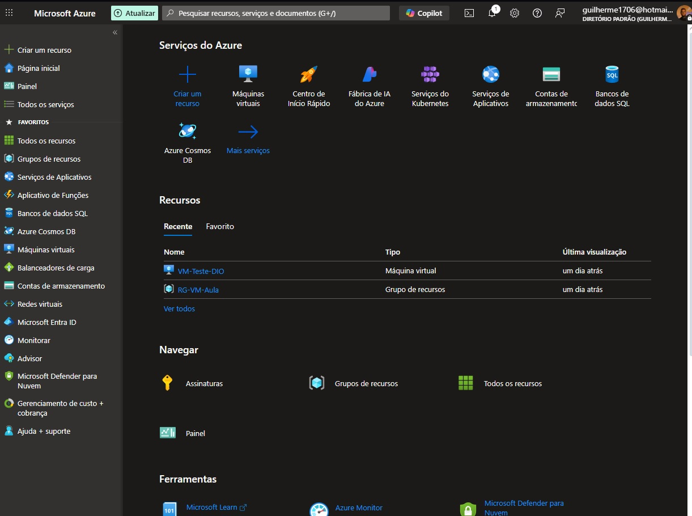
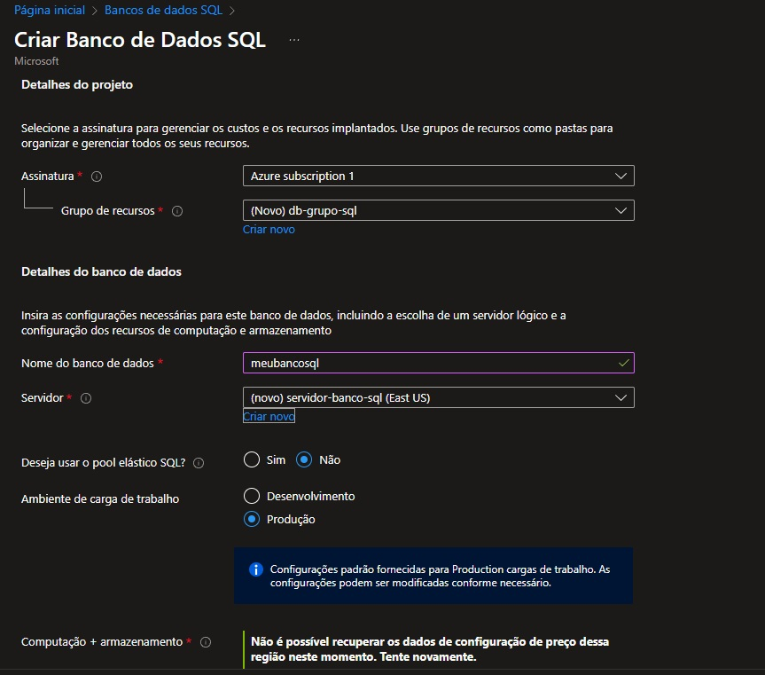
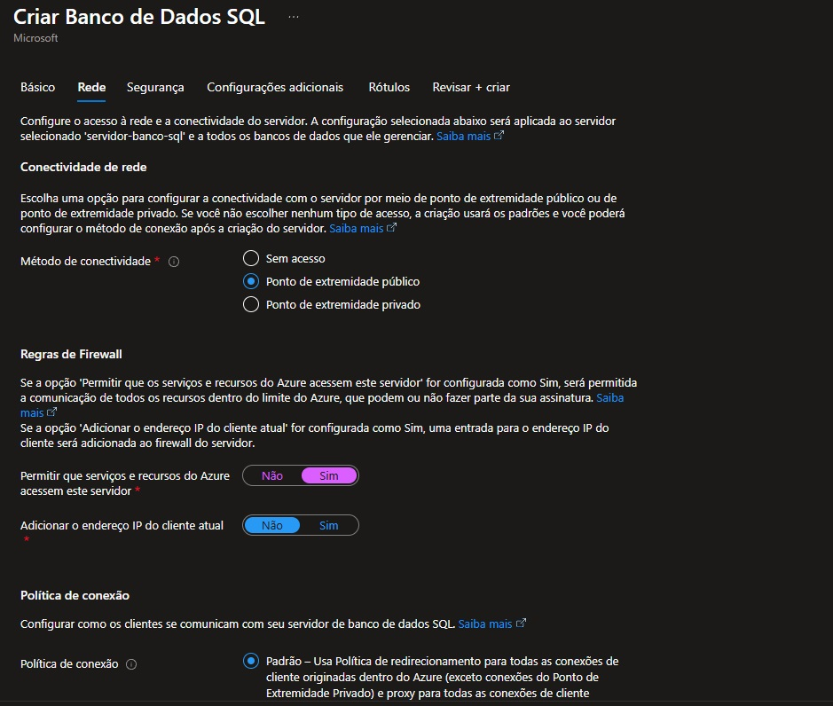
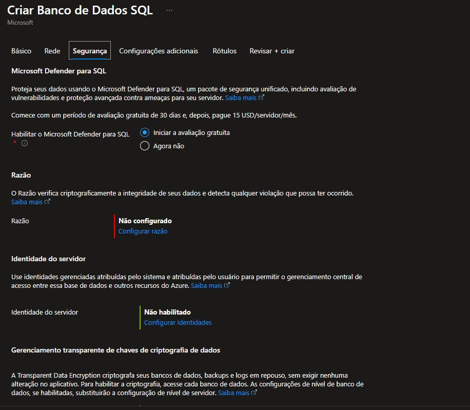

# 🌐 Configuração de Banco de Dados SQL no Microsoft Azure

Este repositório documenta passo a passo a criação e configuração de uma instância de **Banco de Dados SQL no Azure**, como parte do desafio prático da disciplina.

---

## 📋 Objetivo

Realizar a configuração de uma instância de banco de dados SQL no Azure, garantindo:
- Criação do recurso corretamente
- Configuração de autenticação
- Acesso remoto ao banco de dados
- Documentação de todo o processo com capturas de tela

---

## 🛠️ Etapas Realizadas

### 1. Acesso ao Portal Azure
Acessamos o portal através do link: [https://portal.azure.com](https://portal.azure.com)

> 

---

### 2. Criação do recurso "Banco de Dados SQL"
- Recurso selecionado: **SQL Database**
- Grupo de Recursos criado: `db-grupo-sql`
- Nome do banco: `meubancosql`
- Criado novo servidor com:
  - Nome: `servidor-banco-sql`
  - Login: `adminuser`
  - Senha: (senha segura)

> 

---

### 3. Configuração de Firewall e Acesso
- IP público adicionado à lista de permissões
- Permissão de acesso ao Azure ativada
- Teste de conexão com o banco feito com sucesso via SSMS

> 

---

### 4. Acesso ao Banco com SSMS
- Servidor acessado remotamente com as credenciais fornecidas
- Banco validado e disponível para operações

> 

---

## ✅ Resultado Final

A instância do banco de dados SQL no Azure foi criada e está funcional. Todos os requisitos do desafio foram atendidos com sucesso.

---

## 📎 Prints e Evidências

Todos os prints do processo estão na pasta [`images/`](images/).

---

## ✍️ Autor

**Guilherme Alves**  
Aluno do curso DIO
https://github.com/bitsbygui

